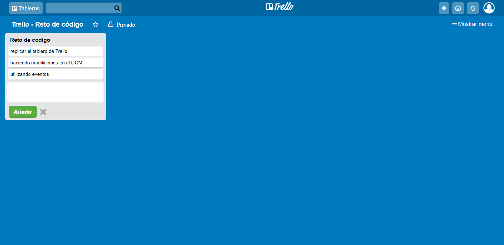

## **TRELLO - RETO DE CÓDIGO** 

En reto consiste en replicar el tablero de Trello, como se muestra a continuación en la siguiente imagen:

### Versiones del Tablero Trello:

+ Versión 0.0.1  
Se mostrará el texto "Añadir una lista ...".
Al hacer click se debe ocultar el texto y mostrar un formulario.
El formulario está conformado por un input y un botón para que pueda añadir tareas a tu lista.

+ Versión 0.0.2  
Al dar click en el botón de "Guardar", se mostrará un nuevo cuadro donde estará el nombre de la lista agregada.
Mostrar un texto de "Añadir una tarea" dentro de la lista.

+ Versión 0.0.3  
Al dar click en "Añadir una tarea", deberá mostrar un formulario con un textarea y un botón que diga "Añadir".

+ Versión 0.0.4  
Poner focus al input al dar click en "Agregar nueva tarea".
Al dar click en el botón de "Añadir", deberá aparecer el texto de la tarea debajo del título de la lista.

+ Versión 0.0.5  
Mostrar el formulario nuevamente debajo de la última tarea añadida.

### **Detalles  del Repositorio**

+ Se encuentra una archivo *index.html* el cual muestra la estructra inicial con la que se inicializa la página web.

+ Se encuentra un archivo *main.css* , en el cual se detallan todos los estilos utilizados para el diseño de la web de Trello. También incluye los estilos agragados mediante el uso de javascrit.

+ Se encuentra un archivo *app.js* el cual muestra el código utilizado para darle interactividad a el tablero de Trello.

+ La carpeta *assets/icons* almacena las fuentes de los iconos utilizados en el diseño de la web :
[Font-awesome](http://fontawesome.io/ "titulo") y [icomoon](http://joedicastro.com "titulo").

+ La carpeta *assets/images* almacena la imagen del logo de Trello.
